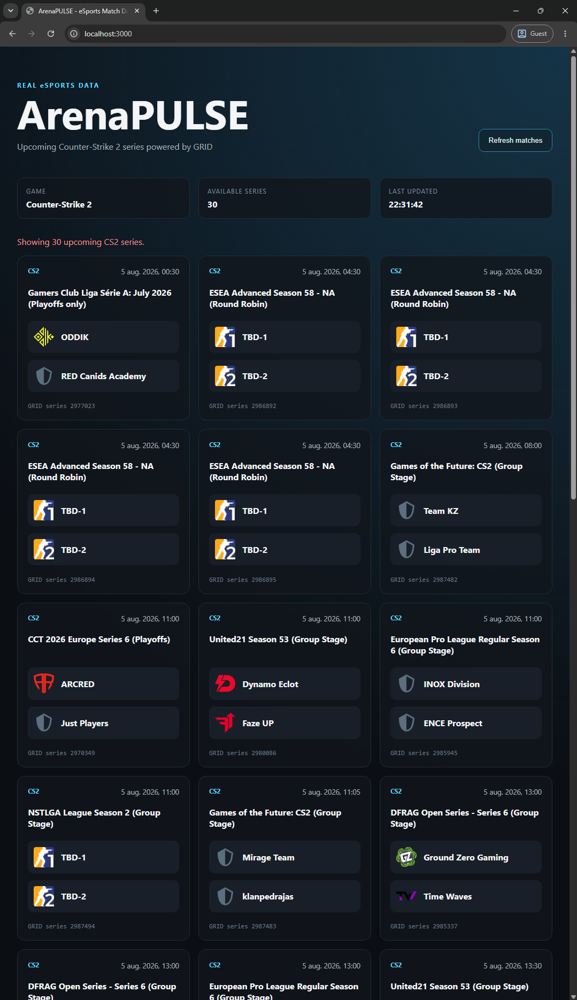

# ArenaPULSE

ArenaPULSE is a real-time eSports match dashboard that retrieves official match data from the GRID Open Access API and presents upcoming Counter-Strike 2 series through a responsive web interface.

The project demonstrates a complete data flow from an external GraphQL API, through a Node.js backend and normalization layer, to a browser-based dashboard.

> Current status: Functional portofolio prototype.

## Live Demo

[Open the live dashboard](https://arena-pulse.pages.dev)

## Preview 



## Current Features

- Upcoming Counter-Strike 2 series retrieved from GRID Open Access
- Secure server-side GRID API authentication
- GraphQL integration through a dedicated service layer
- Normalization of provider-specific data into an ArenaPULSE model
- Filtering by name and removal of GRID test series
- Responsive match-card dashboard
- Team names and logos
- Tournament and scheduled-time information
- Localized date and time formatting
- Manual dashboard refresh
- Loading, empty and error states
- REST endpoints for mock and GRID-backed match data

## Planned features

- Live match state updates
- WebSocket communication
- Match event processing
- Player statistics
- MySQL persistence
- REST API for match history

## Architecture

```text
Browser
  │
  │ GET /api/grid/series/upcoming?game=cs2
  ▼
ArenaPulse API
  │
  │ getUpcomingGridSeries()
  ▼
GRID service
  │
  │ authenticated GraphQL request
  ▼
GRID Central Data API
  │
  │ provider-specific response
  ▼
GRID adapter
  │
  │ normalized ArenaPulse series
  ▼
Express JSON response
  │
  ▼
Browser DOM rendering
```
The browser never communicates directly with GRID and never receives the GRID API key.

## Technology Stack

### Backend

- Node.js
- Express 5
- JavaScript ES modules
- Native Fetch API
- GRID Central Data GraphQL API

### Frontend

- HTML5
- CSS3
- Vanilla JavaScript
- DOM API
- Fetch API
- `Intl.DateTimeFormat`

### Development

- Git and GitHub
- npm
- VS Code
- Node.js watch mode
- Environment-based configuration

## Project Structure
```text
ArenaPulse/
├── public/
│   ├── css/
│   │   └── styles.css
│   ├── js/
│   │   └── dashboard.js
│   └── index.html
├── src/
│   ├── adapters/
│   │   └── gridSeriesAdapter.js
│   ├── data/
│   │   └── matches.js
│   ├── services/
│   │   └── gridClient.js
│   └── server.js
├── .env.example
├── .gitignore
├── package.json
├── package-lock.json
└── README.md
```
## Data flow

1. The browser requests the ArenaPulse GRID endpoint.
2. Express calls the GRID service layer.
3. The service sends an authenticated GraphQL request to GRID.
4. The GRID response is validated for HTTP and GraphQL errors.
5. The adapter converts the GRID response into an ArenaPulse-owned model.
6. Test series and unwanted games are filtered out.
7. Express returns normalized JSON.
8. The browser creates and renders the match cards.

## API Endpoints

### Health check

```http
GET /api/health
```

### All in-memory matches

```http
GET /api/matches
```

### Current in-memory live match

```http
GET /api/matches/live
```

### Match lookup by ID

```http
GET /api/matches/:matchId
```

### Upcoming GRID series

```http
GET /api/grid/series/upcoming
```

Optional game filter:

```http
GET /api/grid/series/upcoming?game=cs2
```

## Running Locally

### Prerequisites

- Node.js 24 LTS recommended
- npm
- A GRID Open Access API key

### Installation

````bash
git clone REPOSITORY_URL
cd ArenaPULSE
npm install
````

Create a local `.env` file from `.env.example`:

````env
GRID_API_KEY=your_GRID_api_key
PORT=3000
````

Start the development server:

````bash
npm run dev
````

Open:

````text
http://localhost:3000
````

For a standard start without watch mode:

````bash
npm start
````

## Environment Variables

| Variable | Required | Description |
| --- | --- | --- |
| `GRID_API_KEY` | Yes | Private GRID Open Access API key |
| `PORT` | No | HTTP server port; defaults to `3000` |

The real `.env` file is excluded from Git and must never be committed.

## Security

- The GRID API key is read only by backend code.
- Secrets are stored in environment variables.
- External team and tournament names are inserted with `textContent` instead of `innerHTML`.


## Roadmap

- Interactive match cards
- Individual series details
- GRID Series State integration
- Live score and map information
- Automatic state refresh
- WebSocket updates from ArenaPulse to the browser
- Player and team statistics
- Match history stored in MySQL
- Pagination and caching
- Automated tests
- CS2 and Dota 2 dashboard filters

## Data Source and Disclaimer

Match and team data is provided through GRID Open Access.

ArenaPulse is an independent educational and portfolio project. It is not
affiliated with GRID, tournament organizers, teams, or game publishers.
Provider data and assets remain subject to their respective owners and
licensing terms.

## License

This project is licensed under the GNU Affero General Public License v3.0. 
See [LICENSE](LICENSE) for details.

Third-party match data, team logos and trademarks are not covered by this license and remain subject to their respective owners' terms.
